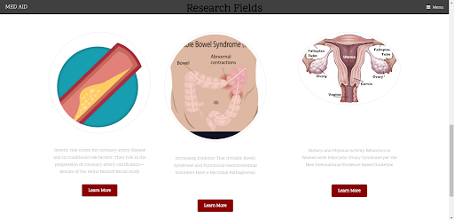

# MED AID

## Problem Statement :
Many people may experience anxiety when seeking medical treatment. Women and non-binary individuals have an added fear: gender-related discrimination. Let it be career-related or health-related they face a lot of gender disparities. Women and non-binary individuals are often underdiagnosed when seeking medical care due to the issues of inequality that persist in the healthcare industry. Many individuals also desire to enter the fields of medical entrepreneurship or healthcare but are discouraged due to gender discrimination in the field.

## Introduction :
Gender inequality and gender stereotypes are still a concern among women and non-binary individuals whole over the society whether it be career-related or medical-related. Our community aims at providing these individuals, with adequate mentor support and a platform to network and seek advice for the challenges they are facing.
Gender inequality prevailing in the medical industry is leading to the under-diagnosing of women as well as non-binary individuals. Through this platform, we provide experienced women medical professionals, through which our community members can get access to the right guidance and support.
Through this community, we also aim at providing as well as improving more career opportunities for those who face gender discrimination or gender inequality to enter the fields of medical entrepreneurship and healthcare.

## Features :
### Medical Entrepreneurship:
We provide support on resources to help your business succeed! We have helpful advice regarding marketing, articles, insurance, legality, software, and much more. You will also have the opportunity to connect with an entrepreneur for professional advice.

### Aspiring Health Workers:
Minority groups often feel discouraged to enter the workforce. We are here to end gender inequality and guide you through the process! You will also have the opportunity to shadow a medical professional and possibly intern with them.

### Medicine Today:
Minorities often go underdiagnosed, which can lead to their condition causing severe damage to their health before being treated. This section will provide you with the medical issues that minorities such as women and non-binaries are currently facing and research that is currently taking place.

### Advancements and Research:
This section provides information on the effects of disparity and lack of diversity in the research field including clinical trials. Members will have the ability to connect with women researchers in the field and learn about women-owned research labs.

### Share your story:
Members and medical professionals will be given the platform to share their experiences and stories as a way to connect with other underrepresented members in the fields of business and medicine.

## Tech Stack :
- HTML
- CSS
- JavaScript

